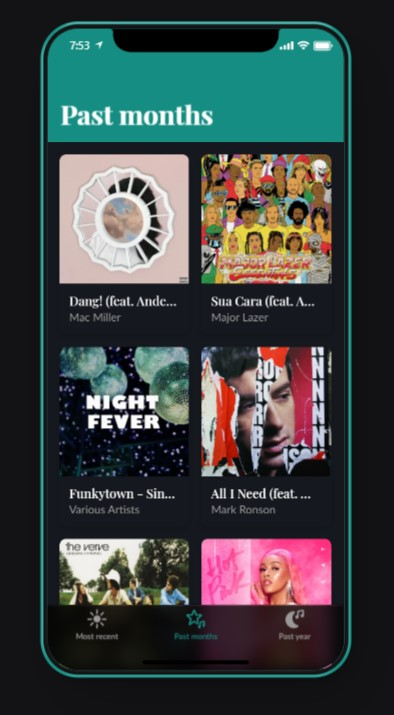

# Spotify_wrapped_music
App that returns my 10 top songs from Spotify - made following this John Manelli's [tutorial](https://jman4190.medium.com/build-your-own-spotify-wrapped-with-python-spotify-and-glide-apps-493dc7da20b)

# DATA
The data is retrieved from my Spotify account with the help of the Spotify API. 
The app is programmed to return the top ten songs.

# TOOLS & TECHNIQUES
- Spotify API
- Googlesheet API
- Glide (no code site to create an app)

# RESULTS
 
